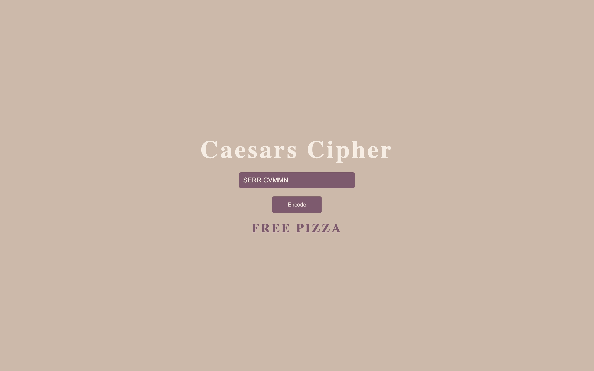

# Caesars Cipher

A Program that emulates a Caesar Cipher  
**It only works with UpperCase Alphabet and only does a 13 Rotation**

## Screenshots

## Demo

[Link](https://thepageguy.github.io/caesars_cipher/)

## Author

- [@thepageguy](https://www.github.com/thepageguy)

## Acknowledgement

- [FreeCodeCamp](https://www.freecodecamp.org/)

## Tech Stack

**Languages:** HTML5, CSS3 and JavaScript

## Features

- Responsive
- 13 Cipher Rotation

## Lessons Learned

- JS Objects
- Simple Regex Expressions and Testing
- Js Arrays Modifications
- Transforming Text Input into Arrays

## Feedback

If you have any feedback, please reach out at thepageguy@mailfence.com.
